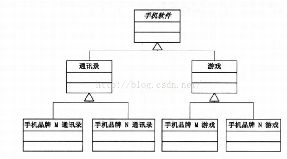
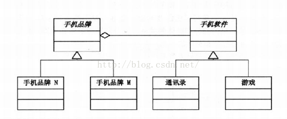
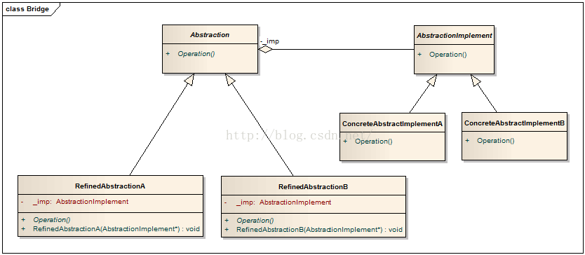

c++ 设计模式之桥接模式（Bridge）

mrailence 2016-11-09 18:35:02  1119  收藏
分类专栏： C++设计模式
版权
作用：将抽象部份与它的实现部份分离，使它们都可以独立地变化。

将抽象(Abstraction)与实现(Implementation)分离，使得二者可以独立地变化。

桥接模式号称设计模式中最难理解的模式之一，关键就是这个抽象和实现的分离非常让人奇怪，大部分人刚看到这个定义的时候都会认为实现就是继承自抽象，那怎么可能将他们分离呢。

《大话设计模式》中就Bridge模式的解释：

手机品牌和软件是两个概念，不同的软件可以在不同的手机上，不同的手机可以有相同的软件，两者都具有很大的变动性。如果我们单独以手机品牌或手机软件为基类来进行继承扩展的话，无疑会使类的数目剧增并且耦合性很高，（如果更改品牌或增加软件都会增加很多的变动）两种方式的结构如下：

//所以将两者抽象出来两个基类分别是PhoneBrand和PhoneSoft，那么在品牌类中聚合一个软件对象的基类将解决软件和手机扩展混乱的问题，这样两者的扩展就相对灵活，剪短了两者的必要联系，结构图如下：

UML 图如下：

抽象基类及接口：

1、Abstraction::Operation()：定义要实现的操作接口

2、AbstractionImplement::Operation()：实现抽象类Abstaction所定义操作的接口，由其具体派生类ConcreteImplemenA、ConcreteImplemenA或者其他派生类实现。

3、在Abstraction::Operation()中根据不同的指针多态调用AbstractionImplement::Operation()函数。

理解:
Bridge用于将表示和实现解耦,两者可以独立的变化.在Abstraction类中维护一个AbstractionImplement类指针,需要采用不同的实现方式的时候只需要传入不同的AbstractionImplement派生类就可以了.

Bridge的实现方式其实和Builde十分的相近,可以这么说:本质上是一样的,只是封装的东西不一样罢了.两者的实现都有如下的共同点:

抽象出来一个基类,这个基类里面定义了共有的一些行为,形成接口函数(对接口编程而不是对实现编程),这个接口函数在Buildier中是BuildePart函数在Bridge中是Operation函数;

其次,聚合一个基类的指针,如Builder模式中Director类聚合了一个Builder基类的指针,而Brige模式中Abstraction类聚合了一个AbstractionImplement基类的指针(优先采用聚合而不是继承);

而在使用的时候,都把对这个类的使用封装在一个函数中,在Bridge中是封装在Director::Construct函数中,因为装配不同部分的过程是一致的,而在Bridge模式中则是封装在Abstraction::Operation函数中,在这个函数中调用对应的AbstractionImplement::Operation函数.就两个模式而言,Builder封装了不同的生成组成部分的方式,而Bridge封装了不同的实现方式.

桥接模式就将实现与抽象分离开来，使得RefinedAbstraction依赖于抽象的实现，这样实现了依赖倒转原则，而不管左边的抽象如何变化，只要实现方法不变，右边的具体实现就不需要修改，而右边的具体实现方法发生变化，只要接口不变，左边的抽象也不需要修改。

常用的场景
1.当一个对象有多个变化因素的时候，考虑依赖于抽象的实现，而不是具体的实现。如上面例子中手机品牌有2种变化因素，一个是品牌，一个是功能。

2.当多个变化因素在多个对象间共享时，考虑将这部分变化的部分抽象出来再聚合/合成进来，如上面例子中的通讯录和游戏，其实是可以共享的。

3.当我们考虑一个对象的多个变化因素可以动态变化的时候，考虑使用桥接模式，如上面例子中的手机品牌是变化的，手机的功能也是变化的，所以将他们分离出来，独立的变化。

优点
1.将实现抽离出来，再实现抽象，使得对象的具体实现依赖于抽象，满足了依赖倒转原则。

2.将可以共享的变化部分，抽离出来，减少了代码的重复信息。

3.对象的具体实现可以更加灵活，可以满足多个因素变化的要求。

缺点
1.客户必须知道选择哪一种类型的实现

代码如下“

// Implemement.hpp

#pragma  once 
 
#include"stdafx.h"
#include<iostream>
 
using namespace  std;
 
 
 
class AbstractionImlement
{
public: 
	virtual ~AbstractionImlement()
	{
	
	}
 
	virtual void Operation() = 0;
 
protected:
	AbstractionImlement()
	{
	
	}
};
 
class ConcreteAbstractionImplemetA:public AbstractionImlement
{
public:
	ConcreteAbstractionImplemetA()
	{
	}
	~ConcreteAbstractionImplemetA()
	{
	
	}
 
	void Operation()
	{
		 cout << "通讯录 Operation" << endl;
	}
 
};
 
 
class ConcreteAbstractionImplemetB:public AbstractionImlement
{
public:
	ConcreteAbstractionImplemetB()
	{
	}
	~ConcreteAbstractionImplemetB()
	{
	
	}
 
	void Operation()
	{
		 cout << "软件  Operation" << endl;
	}
 
};

//Bridge.hpp
#pragma once 
#include"stdafx.h"
#include"Implement.hpp"
#include<iostream>
 
using namespace std;
 
 
 
 
 
class Abstraction
{
public:
	virtual  void Operation() = 0;
 
	virtual ~Abstraction()
	{
	
	}
protected:
	Abstraction()
	{
	
	}	
 
 
};
 
class RefinedAbstrctionA : public Abstraction
{
public:
	RefinedAbstrctionA(AbstractionImlement *Imp):m_Imp(Imp)
	{
	
	}
	~RefinedAbstrctionA()
	{
	
	}
 
	void Operation() 
	{
		 cout << "手机品牌 A::Operation" << endl;
		 m_Imp->Operation();
	}
private:
	AbstractionImlement* m_Imp;
 
 
};
 
 
class RefinedAbstrctionB:public Abstraction
{
public:
	RefinedAbstrctionB(AbstractionImlement *Imp):m_Imp(Imp)
	{
	
	}
	~RefinedAbstrctionB()
	{
	
	}
	void Operation()
	{
		 cout << "手机品牌B::Operation" << endl;
		 m_Imp->Operation();
	}
private:
	AbstractionImlement* m_Imp;
 
};

client:
// BridgeMode.cpp : 定义控制台应用程序的入口点。
//
 
#include "stdafx.h"
#include"Bridge.hpp"
 
 
int _tmain(int argc, _TCHAR* argv[])
{
 
	 AbstractionImlement* imp = new ConcreteAbstractionImplemetA();        //实现部分ConcreteAbstractionImplementA
     Abstraction* abs = new RefinedAbstrctionA(imp);                         //抽象部分RefinedAbstractionA
     abs->Operation();
 
     cout << "-----------------------------------------" << endl;
 
    AbstractionImlement* imp1 = new ConcreteAbstractionImplemetB();        //实现部分ConcreteAbstractionImplementB
     Abstraction* abs1 = new RefinedAbstrctionA(imp1);                        //抽象部分RefinedAbstractionA
     abs1->Operation();
 
     cout << "-----------------------------------------" << endl;
 
     AbstractionImlement* imp2 = new ConcreteAbstractionImplemetA();        //实现部分ConcreteAbstractionImplementA
     Abstraction* abs2 = new RefinedAbstrctionB(imp2);                        //抽象部分RefinedAbstractionB
     abs2->Operation();
 
     cout << "-----------------------------------------" << endl;
 
     AbstractionImlement* imp3 = new ConcreteAbstractionImplemetB();        //实现部分ConcreteAbstractionImplementB
     Abstraction* abs3 = new RefinedAbstrctionB(imp3);                        //抽象部分RefinedAbstractionB
     abs3->Operation();
 
     cout << endl;
 
	system("pause");
	return 0;
}
//运行结果

————————————————
版权声明：本文为CSDN博主「mrailence」的原创文章，遵循CC 4.0 BY-SA版权协议，转载请附上原文出处链接及本声明。
原文链接：https://blog.csdn.net/mrailence/article/details/53103284